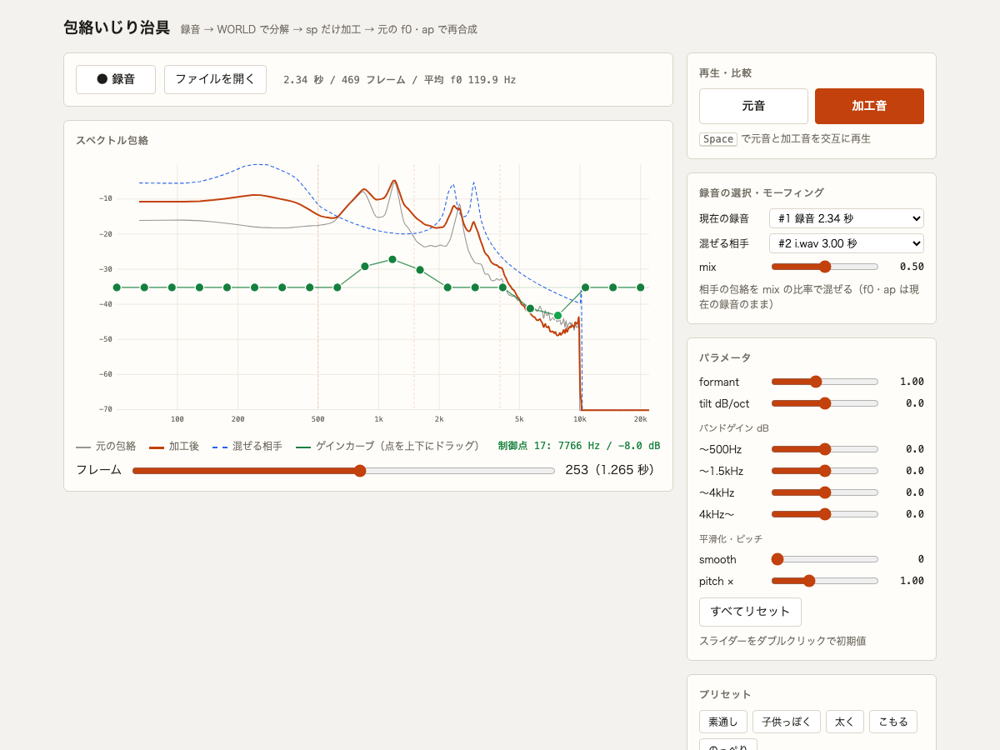

# 変更履歴

記法は [Keep a Changelog](https://keepachangelog.com/ja/1.1.0/)、採番は [SemVer](https://semver.org/lang/ja/) に従う。

## [0.1.0] - 2026-09-18

録音した声を WORLD で分解し、スペクトル包絡だけを加工して聴き比べる治具の最初のリリース。

### 追加

**録音と分解**

- ブラウザで録音（10 秒で自動停止）し、pyworld で f0 / sp / ap に分解する
- 手元の音声ファイルの読み込み（`002-wav-load`）。webm・wav などを ffmpeg 経由で受け付ける
- 分解結果はサーバー内に最新 10 件まで保持し、UI の選択欄から切り替えられる

**包絡の加工**（適用順は morph → formant → smooth → tilt → bands → ゲインカーブ）

- フォルマントシフト（周波数軸の伸縮）、スペクトル傾斜、4 バンドのゲイン、ケプストラム平滑化、fo スケール
- 2 つの録音の包絡モーフィング（`003-morph`）。相手を現在の録音の長さに線形に伸縮し、対数領域で混ぜる。fo と ap は現在の録音のまま
- グラフ上の 20 点をドラッグして作るゲインカーブ（`004-gain-curve`）。50Hz〜20kHz の対数等間隔、±12dB

**聴き比べ**

- 元音と加工音の再生。Space キーで交互に切り替え
- 元の包絡・加工後の包絡・混ぜる相手の包絡を重ねた対数軸グラフ（500 / 1500 / 4000Hz に目安線）

**操作の分かりやすさ**（`005-ui-affordance`）

- 説明はツールチップで表示（ポインタ・キーボードフォーカスの両方、Escape で閉じる）
- 初期値から動かしたスライダーだけ色が付く

### 性能

3 秒の音声・Apple Silicon Mac での実測（中央値）。目標は分解 1.0 秒未満・再合成 0.3 秒未満。

| 処理 | 実測 | 目標 |
|---|---|---|
| 分解（`/api/analyze`） | 0.47 秒 | < 1.0 秒 |
| 再合成（`/api/synthesize`） | 0.04 秒 | < 0.3 秒 |

### 検証

- 5 アイテム 149 仕様すべて PASS、孤児 0 件（`docs/items/*/verification.md`、リビジョン `ce54387`）
- 自動テスト 238 件（DSP のユニット、API の統合、Playwright による E2E）
- 人の耳での受け入れ試聴 M1〜M3 すべて合格

### 既知の制限

- リアルタイム処理はしない（録音 → 解析 → 再生のターン制）
- 保持は最大 10 件、プロセスを終えると消える
- 加工結果の書き出し、時間変化する加工、DTW による時間対応付けは未実装
