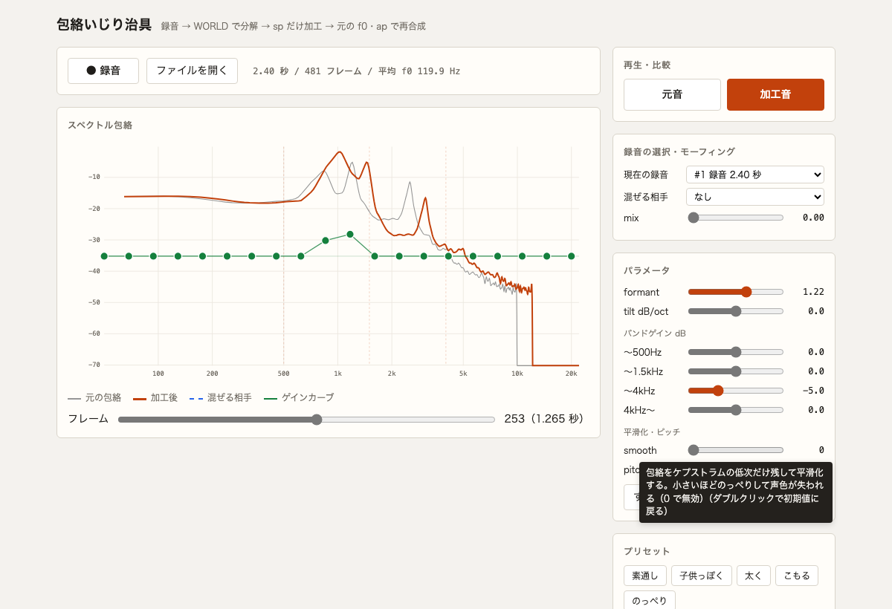

# スペクトル包絡いじり治具

その場で録音した声を WORLD（pyworld）で分解し、スペクトル包絡（sp）だけを加工して再合成し、元音と聴き比べるローカルツール。



## 必要なもの

- Python 3.13 / [uv](https://github.com/astral-sh/uv)
- ffmpeg（ブラウザの webm/opus 録音をデコードするため。`brew install ffmpeg`）
- Chromium 系ブラウザ（マイク録音に MediaRecorder を使う）

## 起動

```bash
uv venv --python 3.13 .venv
VIRTUAL_ENV=$PWD/.venv uv pip install -r requirements.txt
.venv/bin/python jig/server.py            # --port で変更可（既定 8000）
```

`http://localhost:8000/` を開く（マイク権限のため `localhost` で開く）。サーバーは 127.0.0.1 だけで待ち受ける。

## 使い方

1. 「● 録音」で録音開始、もう一度押すと停止して分解（10 秒で自動停止）。「ファイルを開く」で手元の音声ファイルも読める
2. スライダーを動かすと 300ms 後に包絡グラフが更新される（ダブルクリックで初期値）
3. グラフ上の緑の点を上下にドラッグすると、任意の dB ゲインカーブを全フレームに加えられる
4. 「混ぜる相手」に別の録音を選び mix を上げると、相手の包絡が混ざる（モーフィング）
5. 「元音」「加工音」、または **Space** で交互に再生して聴き比べる

加工は morph → formant → smooth → tilt → bands → ゲインカーブ の順に適用される。
pitch は再合成時に fo（基本周波数）に掛けるだけで、fo と ap は常に「現在の録音」のものを使う。
表記は Titze らの合意（下付きは oscillation の o）に従って fo とする。ただし pyworld の識別子と API の `f0_mean` は元の綴りのまま。

モーフィングでは、相手の包絡を現在の録音のフレーム数に線形に伸縮してから、mix の比率で対数領域で混ぜる。

## テスト

```bash
.venv/bin/python -m playwright install chromium   # E2E 用（初回のみ）
.venv/bin/pytest                                  # 全件（約 2 分）
.venv/bin/pytest tests/test_dsp.py tests/test_api.py   # UI 以外
```

E2E は Chromium の偽マイクに合成母音を流して、録音から再生までを確かめる。

## 文書

開発アイテムごとに `docs/items/<アイテム>/` に spec.md（仕様）/ test-design.md（テスト設計）/ verification.md（独立検証レポート）を置く。

| アイテム | 内容 | 仕様ID |
|---|---|---|
| `001-envelope-jig` | 録音・分解・sp 加工・再合成・A/B 比較・包絡グラフ | SPEC-001〜261 |
| `002-wav-load` | 音声ファイルの読み込み | SPEC-300〜306 |
| `003-morph` | 2 つの録音の包絡モーフィング | SPEC-400〜430 |
| `004-gain-curve` | ドラッグで描くゲインカーブ | SPEC-500〜520 |

元の要件からの修正点は `001-envelope-jig/spec.md` の「要件からの修正・補完」節にまとめてある。
ID の対応が切れていないかは `~/dev/.claude/hooks/trace-check.sh` で検査する。
